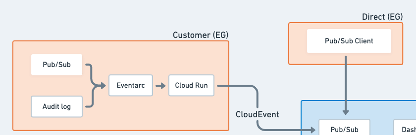
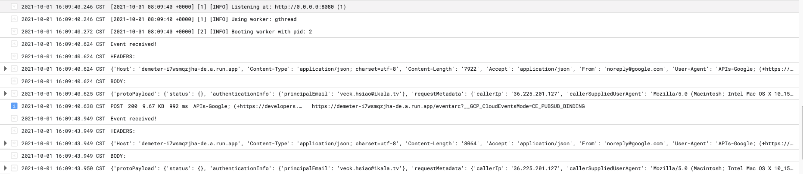

# Demeter (WIP)

This project is for iKala AIOps project - Event Generator part.

## Detail

[Project description](https://gcp.corp.ikala.tv/projects/gcp/wiki/Progress_MVP)



## Architecture

```shell
.
├── publisher.py
├── subscriber.py
├── Dockerfile
└── main.py
```


> NOTICE: The best practice is to avoid upload key-paris to third-party repository which is risky to key leaking.

## Permission

The roles for service account that contain permissions to receive message from eventarc and invoke Cloud Run service.


## Cloud Run
### Deployment

1. Deploy from source using the following command:

```shell
$ gcloud config set project customer-a-project-1

$ gcloud run deploy demeter --region=asia-east1 --set-env-vars TOPIC_ID=<ER PUB/SUB TOPIC ID FOR EG PROJECT> --set-env-vars CUSTIOMER=<CUSTOMER NAME> --source=.
```
Then wait a few moments until the deployment is complete. On success, the command line displays the service URL.

2. Visit your deployed service by opening the service URL in a web browser.

**NOTICE**
[New project first deploy EG CR]

1. EG 第一次 deploy 需要到 console Enable cloud build API，已切換 service account credential的 gcloud 會一直無法

2. Deploy 完畢要用 /connect 建立 eventarc trigger 出現：
    ```
    ERROR: (gcloud.eventarc.triggers.create) PERMISSION_DENIED: Permission "eventarc.events.receiveAuditLogWritten" denied on "1097778675156-compute@developer.gserviceaccount.com"
    ```
    但是 service account 已經是 Editor

    Benson 表示 default service account 需要 **Eventarc Event Receiver**，Editor role 確實沒有這個，加上去後就成功呼叫 /connect 來建立 eventarc trigger 了

### Test

To test API, you can use `curl` to access via service endpoint:

```shell
$ curl -H \
"Authorization: Bearer $(gcloud auth print-identity-token)" \
https://demeter-i7wsmqzjha-de.a.run.app
```

**View Eventarc messages in Cloud Run when IAM policy changed**


## Reference

- [Cloud Pub/Sub - Using client libraries](https://cloud.google.com/pubsub/docs/quickstart-client-libraries#pubsub-client-libraries-python)
- [Cloud Run - Build and deploy (Python)](https://cloud.google.com/run/docs/quickstarts/build-and-deploy/python)
